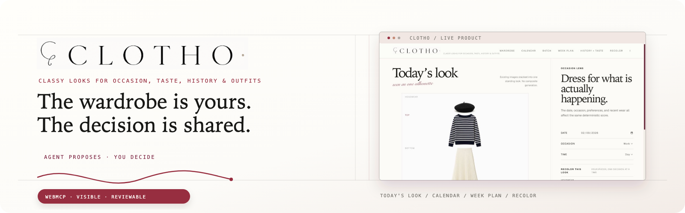
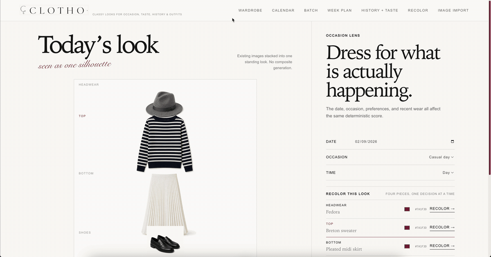
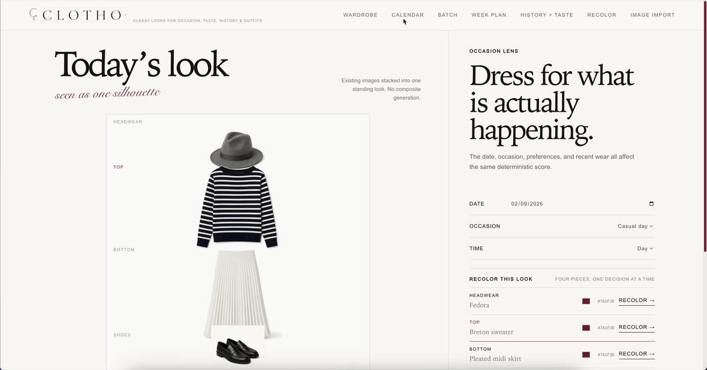
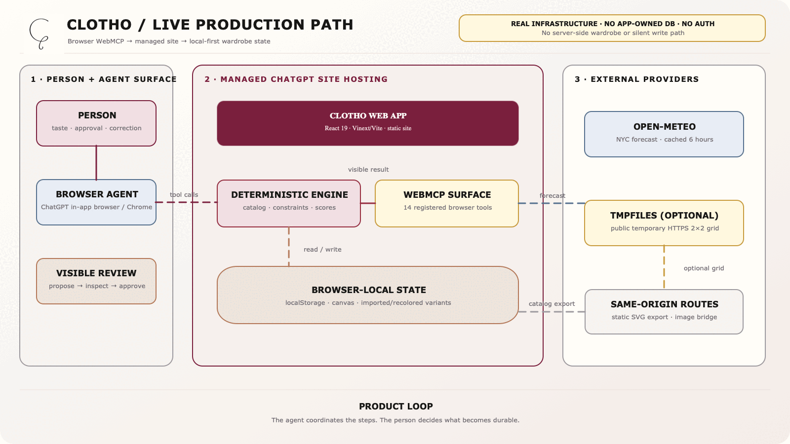
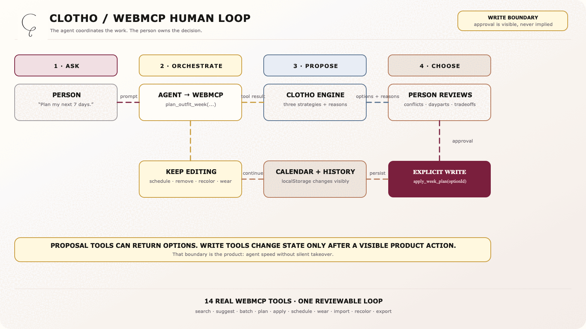

<p align="center">
  
</p>

<div align="center">
  <p><strong>CLOTHO: Classy Looks for Occasion, Taste, History &amp; Outfits</strong></p>
  <p>One wardrobe. A changing week. One decision system.</p>
  <p>
    <a href="https://clotho.azharizzannada.chatgpt.site/"></a>
    <a href="https://webmcp.devpost.com/"></a>
    <a href="docs/submission-description.md"></a>
  </p>
  <p>
    <a href="LICENSE"></a>
    <a href="https://react.dev/"></a>
    <a href="https://vite.dev/"></a>
    <a href="https://www.typescriptlang.org/"></a>
  </p>
  <p>
    <a href="https://clotho.azharizzannada.chatgpt.site/">Live app</a> ·
    <a href="docs/submission-description.md">Hackathon description</a> ·
    <a href="docs/assets/clotho-readme-banner.svg">Banner SVG source</a> ·
    <a href="public/assets/diagrams/clotho-webmcp-human-loop.gif">How it works</a> ·
    <a href="public/assets/diagrams/clotho-production-architecture.gif">Infrastructure</a>
  </p>
  <p><sub>Agent proposes → person reviews → wardrobe state changes visibly</sub></p>
</div>

<details>
<summary><kbd>Contents</kbd></summary>

- [At a glance](#-at-a-glance)
- [The one-turn proof](#the-one-turn-proof)
- [The problem](#the-problem)
- [What CLOTHO does](#what-clotho-does)
- [Product walkthrough](#product-walkthrough)
- [Why WebMCP is the right interface](#why-webmcp-is-the-right-interface)
- [Why CLOTHO stands out](#why-clotho-stands-out)
- [Human and agent boundaries](#human-and-agent-boundaries)
- [WebMCP tool surface](#webmcp-tool-surface)
- [How it works](#how-it-works)
- [Try the live app](#try-the-live-app)
- [Submission checklist](#submission-checklist)
- [Quick start](#-quick-start)
- [Truth boundaries](#truth-boundaries)
- [Repository map](#repository-map)
- [License and attribution](#license-and-attribution)

</details>

> [!IMPORTANT]
> CLOTHO is a real local-first demo, not a shopping catalog or an image-generation claim. It composes a bundled synthetic wardrobe in the browser, exposes real WebMCP tools, and keeps consequential writes explicitly reviewable by default.

## 🧭 At a glance

<table>
  <tr>
    <td width="25%" align="center"><strong>01 / SEE</strong><br><br>Start from a composed outfit and a real occasion: work, casual day, dinner, or event.</td>
    <td width="25%" align="center"><strong>02 / EXPLORE</strong><br><br>Search 44 owned pieces, constrain the combination, or generate up to 30 distinct candidates.</td>
    <td width="25%" align="center"><strong>03 / PLAN</strong><br><br>Ask for a week. CLOTHO weighs calendar moments, NYC weather, taste, and recent wear.</td>
    <td width="25%" align="center"><strong>04 / DECIDE</strong><br><br>Review the option, apply it to the calendar, recolor a piece, record the wear, and keep editing.</td>
  </tr>
</table>

<p align="center"><sub>Designed for a person and an agent to make a decision together, not for an agent to silently take over.</sub></p>

## The one-turn proof

Ask CLOTHO:

> Plan seven days from September 2 for morning, day, and evening. Use a balanced palette, include headwear, avoid orange, and give me three strategies. Do not apply anything until I choose.

That one request coordinates preferences, 21 date/slot decisions, existing calendar occasions, cached weather, recent wear, wardrobe constraints, and three reviewable strategies. The agent does not return a paragraph for the person to rebuild manually. It operates the product, shows the options in CLOTHO, and waits at the write boundary. After the person chooses, one explicit `apply_week_plan` call writes the selected 21-slot strategy to the visible calendar.

## The problem

Wardrobe tools usually stop at inventory or inspiration. They show pieces, maybe suggest a look, and leave the hardest work to the person: reconciling a week of occasions, weather, preferences, repeats, and what is already owned.

An agent can help, but only if it can operate a meaningful product surface. A screenshot that an agent can read is not enough. The agent needs bounded actions, visible results, and a clear handoff when a decision changes durable state.

CLOTHO asks a more practical question:

> What can an agent do with the wardrobe, and where should the person remain in control?

## What CLOTHO does

CLOTHO (Classy Looks for Occasion, Taste, History &amp; Outfits) is a local-first wardrobe planner for turning a small owned wardrobe into reviewable outfit decisions. It keeps the clothing visual, the recommendation deterministic, the calendar editable, and the agent boundary explicit.

| Everyday friction | CLOTHO's answer |
| --- | --- |
| “I own plenty, but I still start from zero.” | Compose existing pieces into one visible silhouette and search the owned catalog. |
| “One look is not a week.” | Build two or three weekly strategies across morning, day, and evening. |
| “The weather changes the plan.” | Use cached NYC weather and expose conflicts such as rain-sensitive shoes or heavy layers on hot days. |
| “I want options, not a roulette wheel.” | Generate up to 30 distinct candidates with scores, constraints, and a human `Use look` action. |
| “I do not want a model to silently save a guess.” | Review before weekly apply, import commit, and recolor persistence. |

## Product walkthrough

These two recordings come from the deployed product, not a mocked dashboard. The first moves through Wardrobe, Week plan, and Recolor. The second opens Calendar and inspects the planned moments. The table below documents all eight live capabilities.

| 1. Overview features | 2. Calendar and planned moments |
| --- | --- |
|  |  |
| Inspect the wardrobe, compare weekly strategies, and preview a recolor. | Review scheduled morning, day, and evening outfits in the calendar. |

| Product capability | What it demonstrates |
| --- | --- |
| Today | Existing images are stacked into one look; the UI states that no composite person image is generated. |
| Wardrobe | The owned catalog can be filtered and inspected without leaving the main editorial surface. |
| Batch | Candidate generation is a bounded, visible operation with a real result set and scores. |
| Week plan | A week is a set of reviewable options, not an invisible auto-schedule. |
| Calendar | The chosen plan becomes durable, visible date/slot state. |
| Recolor | A color change begins as a preview and stays separate from saving a wardrobe variant. |
| Image import | A prepared public HTTPS 2×2 grid becomes reviewable wardrobe crops before anything is committed. |
| Export reference | The current look becomes an openable visual reference without changing wardrobe or calendar state. |

## Why WebMCP is the right interface

WebMCP fits CLOTHO because outfit planning is a sequence of structured actions, not one chat answer. An agent can read the current calendar and preferences, call bounded product operations, inspect the result, and ask the person to choose before a write.

| Without a product tool boundary | With CLOTHO's WebMCP surface |
| --- | --- |
| The agent describes a look and the person manually reconstructs it across several panels. | The agent calls `suggest_outfit` or `generate_outfit_batch`; the real result appears in CLOTHO. |
| A week request becomes a long, uncheckable paragraph. | `plan_outfit_week` returns two or three named strategies with reasons, conflicts, and tradeoffs. |
| “Schedule it” is ambiguous and easy to apply too early. | The person reviews an option, then explicitly triggers `apply_week_plan`. |
| Recolor is described but not persisted consistently. | `recolor_item` previews; a separate save action creates a local variant. |
| Imported photos become an opaque AI step. | `import_image_url` previews a clean 2×2 grid; `commit_wardrobe_items` is the explicit persistence boundary. |

The result is a better division of labor: the agent handles multi-step coordination, while the person supplies taste, approval, correction, and the final “this is what I will wear” decision.

## Why CLOTHO stands out

| What matters | What CLOTHO delivers |
| --- | --- |
| **WebMCP that does real work** | Fourteen registered tools cover search, constraints, preferences, batches, week planning, calendar reads and writes, wear history, import, recolor, and export. JSON schemas, read-only annotations, visible results, and separate preview and commit tools make this a working system rather than scripted UI automation. |
| **A complete product loop** | The public app runs in ChatGPT's in-app browser and Chrome with WebMCP testing enabled. Its deterministic engine, 44-piece catalog, three-daypart calendar, cached weather, browser persistence, imports, recolors, and reference exports work together as one experience. |
| **Less repetitive planning** | One request can produce three inspectable seven-day strategies covering 21 moments. The person can apply or edit the chosen plan instead of manually reconciling wardrobe, weather, calendar, taste, and repeat wear. |
| **A different kind of wardrobe tool** | CLOTHO treats a wardrobe as shared decision state for a person and an agent. The interesting part is not outfit generation alone. It is the visible conversation between proposals, tradeoffs, reversible edits, and explicit durable writes. |

## Human and agent boundaries

| Agent can | Person must still decide |
| --- | --- |
| Search the owned catalog and request a constrained suggestion. | Whether the look actually fits the person's intent. |
| Generate up to 30 distinct candidates and compare scores. | Which candidate becomes the chosen look. |
| Plan a week using calendar, NYC weather, taste, and recent wear. | Whether a weekly option is applied to the calendar. |
| Preview a recolor or prepare a clean import handoff. | Whether a recolor is saved or imported crops are committed. |
| Read calendar plans and visible history. | Whether to edit, remove, wear, or keep any plan. |

## WebMCP tool surface

The page registers 14 tools. They are intentionally grouped here by job rather than presented as a feature checklist.

| Job | Tools | Boundary / result |
| --- | --- | --- |
| Find and propose | `search_products`, `suggest_outfit`, `generate_outfit_batch` | Read or propose against the current visible wardrobe; batch is limited to 1–30. |
| Plan and inspect context | `list_calendar_plans`, `set_preferences`, `plan_outfit_week` | Read calendar/weather and saved taste; return visible, reviewable options. |
| Apply and edit | `apply_week_plan`, `schedule_outfit`, `remove_calendar_plan` | Writes visible calendar state; unrelated plans remain intact when a week is applied. |
| Wear and remember | `record_wear` | Records the visible outfit and accepted inline recolor variants locally. |
| Import safely | `import_image_url`, `commit_wardrobe_items` | Preview first, then commit reviewed crops from a public HTTPS 2×2 grid. |
| Transform and export | `recolor_item`, `export_outfit_reference` | Recolor previews in a 512px browser canvas; export returns an 800×1200 SVG through static HTTP for bundled pieces or a browser-local URL for imported/recolored pieces. |

## How it works

### The production path

This is the infrastructure that is actually running in the live demo, not a generic cloud reference architecture. The app is served from the managed `chatgpt.site` deployment configured in `.openai/hosting.json`; wardrobe state stays in the browser; Open-Meteo is the only live data provider; and the optional image bridge is same-origin code for a public temporary grid URL.

<p align="center">
  
</p>

<p align="center"><a href="public/assets/diagrams/clotho-production-architecture.drawio">Open the editable Draw.io source →</a></p>

### The WebMCP decision loop

WebMCP is not a second backend. The page registers 14 browser tools with `document.modelContext.registerTool`; an agent calls those tools in the browser, CLOTHO returns a visible proposal, and the person decides whether a write should happen.

<p align="center">
  
</p>

<p align="center"><a href="public/assets/diagrams/clotho-webmcp-human-loop.drawio">Open the editable Draw.io source →</a></p>

### The deterministic engine

- 44 synthetic catalog items: 11 tops, 11 bottoms, 11 shoes, and 11 headwear pieces.
- 15,972 theoretical category combinations, including the no-headwear state.
- Same state plus the same seed produces the same result.
- Ranking considers occasion/formality/activity, color compatibility, palette, notes, avoid terms, and recent wear.
- Required and excluded item IDs are validated constraints, not hidden prompt magic.
- Week strategies are `Repeat-light`, `Color study`, and `Weather-first`.
- Cached NYC weather can surface rain/shoe, temperature/layer, and repetition tradeoffs.

### Local-first by design

Preferences, plans, wear history, imported pieces, and recolored variants remain in the browser's `localStorage`. Weather is cached in that browser as well. No personal wardrobe is bundled with the repository.

## Try the live app

- [Open CLOTHO](https://clotho.azharizzannada.chatgpt.site/)
- [Read the hackathon submission description](docs/submission-description.md)
- [Read the WebMCP hackathon](https://webmcp.devpost.com/)

The WebMCP surface is available when the site is opened in ChatGPT's in-app browser or in Chrome with WebMCP testing enabled.

### Suggested demo path

1. Open the live app and start on **Today**.
2. Open **Week plan**, choose seven days and all three dayparts.
3. Review the generated `Repeat-light`, `Color study`, and `Weather-first` options.
4. Select one option and apply it only after reviewing its conflicts/tradeoffs.
5. Open **Calendar** to inspect the visible result; edit or remove one slot.
6. Open **Recolor** and keep the preview separate from **Save as wardrobe variant**.
7. Open **Batch** and request 30 looks; choose one with **Use look**.
8. Open **Image import** to inspect the preview and commit boundary, then use `export_outfit_reference` to open the current look as a visual reference.

## Submission checklist

| Devpost requirement | CLOTHO evidence | Status |
| --- | --- | --- |
| Working live URL | [clotho.azharizzannada.chatgpt.site](https://clotho.azharizzannada.chatgpt.site/) loads publicly and registers the live WebMCP tool surface. | Ready |
| Human text description | [Devpost-ready description](docs/submission-description.md) directly answers the four required questions and covers all four evaluation areas. | Ready |
| Public source repository | [github.com/azharizz/clotho](https://github.com/azharizz/clotho) is public and includes source, assets, setup, and checks. | Ready |
| Visible open-source license | [Apache-2.0](LICENSE) is present at the repository root and detected by GitHub. | Ready |
| Public YouTube demo under three minutes, with audio | Record, upload publicly, and place the final URL in this README and the Devpost form. | **Required before submission** |

## ⚡ Quick start

Requirements: Node.js `22.13+` and npm.

```bash
npm install
npm run dev
```

Open `http://localhost:3000`.

### Checks

```bash
npm run check:engine
npm run check:calendar
npm run check:weather
npm run check:week
npm run lint
npm run build
```

## Truth boundaries

- CLOTHO composes existing catalog images; it does not generate a new worn-person image at runtime.
- `generate_outfit_batch` returns at most 30 actual distinct looks and may return fewer when unique combinations are exhausted.
- `15,972` is theoretical catalog space, not a promise that one batch enumerates every combination.
- Week planning returns proposals. The calendar changes only after a visible human apply action.
- `import_image_url` requires a public HTTPS clean 2×2 grid with exact crop metadata. CLOTHO does not read ChatGPT attachments, local paths, `file://`, `blob:`, `data:`, or base64 values directly.
- Import persistence is separate from preview; `commit_wardrobe_items` saves reviewed crops in this browser only.
- Recolor is a low-resolution browser-canvas preview. Persistence requires an explicit save action.
- `export_outfit_reference` returns a normal static HTTP URL for bundled catalog pieces and a browser-local SVG URL for imported or recolored pieces; browser-local URLs are not portable across browsers or sessions.
- Temporary image hosting is public third-party storage and should be used only for synthetic or non-sensitive feasibility images.

## Repository map

| Path | Purpose |
| --- | --- |
| `app/page.tsx` | Product UI and the complete WebMCP registration surface. |
| `app/globals.css` | Editorial theme, responsive layout, panel depth, and native motion. |
| `lib/outfit-engine.ts` | Catalog composition, scoring, constraints, and deterministic selection. |
| `lib/week-planner.ts` | Multi-day options, dayparts, weather conflicts, and tradeoffs. |
| `lib/calendar.ts` | Browser-local calendar plans and date/slot operations. |
| `lib/recolor.ts` | Browser-canvas foreground mask and recolor preview. |
| `lib/weather.ts` | Open-Meteo NYC fetch and six-hour cache. |
| `app/outfit-reference/route.ts` | Static catalog-only 800×1200 SVG export. |
| `docs/submission-description.md` | Human-written Devpost-ready project description. |
| `public/assets/diagrams/` | Editable Draw.io sources plus animated PNG/GIF exports for the real production path and WebMCP human loop. |
| `docs/assets/` | CLOTHO campaign banner and live product walkthrough. |

## License and attribution

Source code is licensed under [Apache-2.0](LICENSE). The bundled wardrobe is a synthetic test catalog. CLOTHO branding and generated image provenance should be reviewed before reuse in another product.
